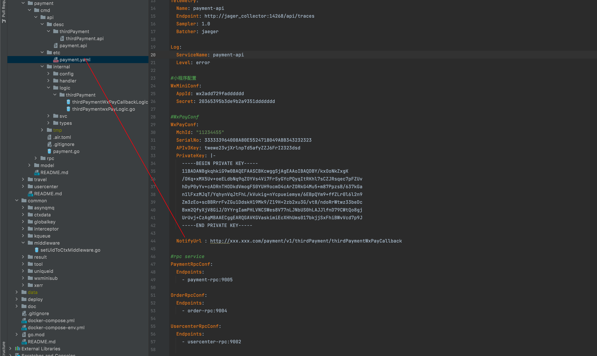
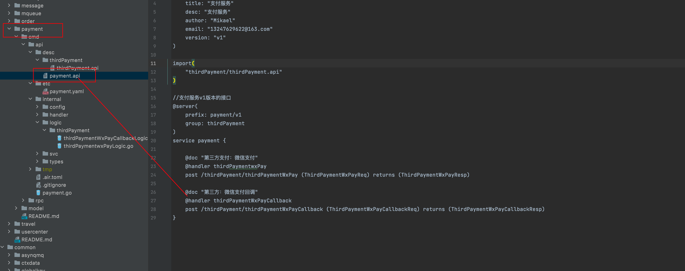
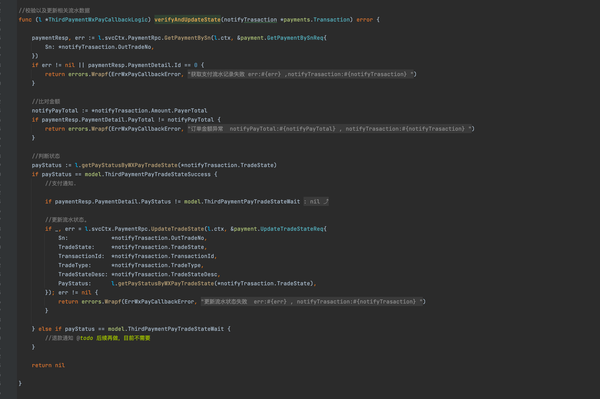

#### 1、支付服务业务架构图


#### 2、依赖关系

payment-api（支付api） 依赖 order-rpc（订单rpc）、payment-rpc（支付rpc）、usercenter（用户rpc）

order-rpc（订单rpc） 依赖 travel-rpc


#### 3、微信支付举例

##### 3.1 创建支付预处理订单

1、用户在我们这边创建完订单之后，要去微信那边创建预支付订单

app/payment/cmd/api/desc/payment.api

```protobuf

//支付服务v1版本的接口
@server(
	prefix: payment/v1
	group: thirdPayment
)
service payment {
	
	@doc "第三方支付：微信支付"
	@handler thirdPaymentwxPay
	post /thirdPayment/thirdPaymentWxPay (ThirdPaymentWxPayReq) returns (ThirdPaymentWxPayResp)
	
	...
}
```


app/payment/cmd/api/internal/logic/thirdPayment/thirdPaymentwxPayLogic.go----->ThirdPaymentwxPay

见下图，我们创建微信预支付订单时候做了一次封装，因为我们平台后续支付业务肯定不止民宿支付订单，肯定还会有其他的，比如我们后续可以推出商城，推出课程等，所以在这里使用switch做了个业务分类，目前我们只有民宿订单，但是除了查询业务不一样，其他都一样，我们把一样的逻辑封装起来，所以我们继续看封装后的方法createWxPrePayOrder


app/payment/cmd/api/internal/logic/thirdPayment/thirdPaymentwxPayLogic.go----->createWxPrePayOrder

这里就是拿到用户的登陆userId去换openid（这块我们之前注册登陆那里有小程序注册登陆，那时候就获取了openid），然后调用paymentRpc中的CreatePayment创建我们本地的支付流水单号，在通过调用微信sdk-> svc.NewWxPayClientV3(这里是我基于go-zero封装了一次，没啥难度都能看懂) ，

然后在微信端创建了一个关联我们本地流水单号的预支付订单，返回给前端，前段通过js发起请求即可


##### 3.2 微信支付回调

当前端拿着我们给的微信预处理订单发起支付，用户输入密码支付成功后，微信服务器会回调我们服务器，回调地址在我们配置中填写的




这个回调地址，一定要填写我们支付api服务中的回调处理方法,也就是如下图的接口，这样我们才能接收到微信回调进来，我们才可以做后续处理。




微信回调回来之后，我们要处理回调逻辑，我们要调用verifyAndUpdateState 将我们流水单号改为已支付 


我们来看看verifyAndUpdateState方法，我们要查询单号是否存在，比对回调回来的金额与创建时候金额是否一致更新流水单号即可。这里不用在校验签名了，前一步的sdk已经做了处理了




这里还要给前端写一个轮训接口，前端用户支付成功后前端不能以前端的微信返回结果为准，要通过后端提供的接口轮训，判断这个流水单是否真的是后端返回支付成功状态，如果这个接口返回成功才算成功，微信前端返回的不能作为依据，因为微信前端返回的不安全，一般开发都明白不知道的自己google。


##### 3.3 支付成功发送小程序模版消息

我们支付回调成功之后，会给用户发送一个入驻码，去了商家那里要展示这个码，商家通过后台核对码，其实就是美团的样子，我们去美团下单，美团会给你个码，用户拿着这个码去入住或者消费等。

ok，回调成功，我们会调用pyamentRpc去修改当前流水单状态成功


我们来看看paymentRpc中做了什么,go-zero-looklook/app/payment/cmd/rpc/internal/logic/updateTradeStateLogic.go

```go

func (l *UpdateTradeStateLogic) UpdateTradeState(in *pb.UpdateTradeStateReq) (*pb.UpdateTradeStateResp, error) {

	.....

	//3、update .
	thirdPayment.TradeState = in.TradeState
	thirdPayment.TransactionId = in.TransactionId
	thirdPayment.TradeType = in.TradeType
	thirdPayment.TradeStateDesc = in.TradeStateDesc
	thirdPayment.PayStatus = in.PayStatus
	thirdPayment.PayTime = time.Unix(in.PayTime, 0)
	if err := l.svcCtx.ThirdPaymentModel.UpdateWithVersion(l.ctx,nil, thirdPayment); err != nil {
		return nil, errors.Wrapf(xerr.NewErrCode(xerr.DB_ERROR), " UpdateTradeState UpdateWithVersion db  err:%v ,thirdPayment : %+v , in : %+v", err,thirdPayment,in)
	}

	//4、notify  sub "payment-update-paystatus-topic"  services(order-mq ..), pub、sub use kq
	if err:=l.pubKqPaySuccess(in.Sn,in.PayStatus);err != nil{
		logx.WithContext(l.ctx).Errorf("l.pubKqPaySuccess : %+v",err)
	}

	return &pb.UpdateTradeStateResp{}, nil
}

```

核心做了两件事情，第一是更新支付状态，第二向消息队列(kafka)发送了一条消息，我们看看消息队列中对应的代码

```go
func (l *UpdateTradeStateLogic) pubKqPaySuccess(orderSn string,payStatus int64) error{

	m := kqueue.ThirdPaymentUpdatePayStatusNotifyMessage{
		OrderSn:  orderSn ,
		PayStatus: payStatus,
	}

	body, err := json.Marshal(m)
	if err != nil {
		return errors.Wrapf(xerr.NewErrMsg("kq UpdateTradeStateLogic pushKqPaySuccess task marshal error "), "kq UpdateTradeStateLogic pushKqPaySuccess task marshal error  , v : %+v", m)
	}

	return  l.svcCtx.KqueuePaymentUpdatePayStatusClient.Push(string(body))
}

```


可以看到我们使用了go-queue发送了一条kq消息到kafka，而不是asynq延迟消息（虽然asynq也支持消息队列我只是在这个功能上想演示如何使用go-queue），因为我们想让所有订阅了该支付状态的业务都能收到此消息后做相应的处理，虽然目前我们只有一个地方监听做处理（发送小程序模版消息通知用户支付成功），所以这里就是发了一条该支付流水相关信息到kafka中，这里跟之前订单那里是一样的只是添加消息到队列，没有处理，那我们看看order-mq中怎么处理的。

go-zero-looklook/app/order/cmd/mq/internal/mqs/kq/paymentUpdateStatus.go

```go
package kq

....

func (l *PaymentUpdateStatusMq) Consume(_, val string) error {

	var message kqueue.ThirdPaymentUpdatePayStatusNotifyMessage
	if err := json.Unmarshal([]byte(val), &message); err != nil {
		logx.WithContext(l.ctx).Error("PaymentUpdateStatusMq->Consume Unmarshal err : %v , val : %s", err, val)
		return err
	}

	if err := l.execService(message); err != nil {
		logx.WithContext(l.ctx).Error("PaymentUpdateStatusMq->execService  err : %v , val : %s , message:%+v", err, val, message)
		return err
	}

	return nil
}

func (l *PaymentUpdateStatusMq) execService(message kqueue.ThirdPaymentUpdatePayStatusNotifyMessage) error {

	orderTradeState := l.getOrderTradeStateByPaymentTradeState(message.PayStatus)
	if orderTradeState != -99 {
		//update homestay order state
		_, err := l.svcCtx.OrderRpc.UpdateHomestayOrderTradeState(l.ctx, &order.UpdateHomestayOrderTradeStateReq{
			Sn:         message.OrderSn,
			TradeState: orderTradeState,
		})
		if err != nil {
			return errors.Wrapf(xerr.NewErrMsg("update homestay order state fail"), "update homestay order state fail err : %v ,message:%+v", err, message)
		}
	}

	return nil
}
....

```

我们再来看order-rpc的UpdateHomestayOrderTradeState

```go

// Update homestay order status
func (l *UpdateHomestayOrderTradeStateLogic) UpdateHomestayOrderTradeState(in *pb.UpdateHomestayOrderTradeStateReq) (*pb.UpdateHomestayOrderTradeStateResp, error) {

	......

	// 3、Pre-update status judgment.
	homestayOrder.TradeState = in.TradeState
	if err := l.svcCtx.HomestayOrderModel.UpdateWithVersion(l.ctx,nil, homestayOrder); err != nil {
		return nil, errors.Wrapf(xerr.NewErrMsg("Failed to update homestay order status"), "Failed to update homestay order status db UpdateWithVersion err:%v , in : %v", err, in)
	}

	//4、notify user
	if in.TradeState == model.HomestayOrderTradeStateWaitUse {
		payload, err := json.Marshal(jobtype.PaySuccessNotifyUserPayload{Order: homestayOrder})
		if err != nil {
			logx.WithContext(l.ctx).Errorf("pay success notify user task json Marshal fail, err :%+v , sn : %s",err,homestayOrder.Sn)
		}else{
			_, err := l.svcCtx.AsynqClient.Enqueue(asynq.NewTask(jobtype.MsgPaySuccessNotifyUser, payload))
			if err != nil {
				logx.WithContext(l.ctx).Errorf("pay success notify user  insert queue fail err :%+v , sn : %s",err,homestayOrder.Sn)
			}
		}
	}


......
}

```

主要就是更改订单状态，在发送一条asynq给mqueue-job队列，让mqueue-job发送微信小程序模版消息给用户

go-zero-looklook/app/mqueue/cmd/job/internal/logic/paySuccessNotifyUser.go

```go

func (l *PaySuccessNotifyUserHandler) ProcessTask(ctx context.Context, t *asynq.Task) error {

	var p jobtype.PaySuccessNotifyUserPayload
	if err := json.Unmarshal(t.Payload(), &p); err != nil {
		return errors.Wrapf(ErrPaySuccessNotifyFail, "PaySuccessNotifyUserHandler payload err:%v, payLoad:%+v", err, t.Payload())
	}

	// 1、get user openid
	usercenterResp, err := l.svcCtx.UsercenterRpc.GetUserAuthByUserId(ctx, &usercenter.GetUserAuthByUserIdReq{
		UserId:   p.Order.UserId,
		AuthType: usercenterModel.UserAuthTypeSmallWX,
	})
	if err != nil {
		return errors.Wrapf(ErrPaySuccessNotifyFail,"pay success notify user fail, rpc get user err:%v , orderSn:%s , userId:%d",err,p.Order.Sn,p.Order.UserId)
	}
	if usercenterResp.UserAuth == nil || len(usercenterResp.UserAuth.AuthKey) == 0 {
		return errors.Wrapf(ErrPaySuccessNotifyFail,"pay success notify user , user no exists err:%v , orderSn:%s , userId:%d",err,p.Order.Sn,p.Order.UserId)
	}
	openId := usercenterResp.UserAuth.AuthKey


	// 2、send notify
	msgs := l.getData(ctx,p.Order,openId)
	for _, msg := range msgs  {
		l.SendWxMini(ctx,msg)
	}

	return nil
}
```


#### 4、结尾

到这里基本上整体项目服务逻辑都差不多说明完了，后续会介绍收集日志、监控、部署等


