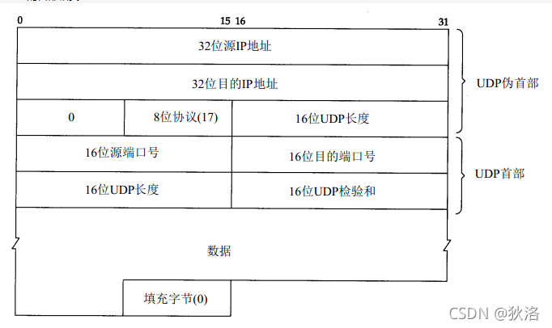

# 概述
udp是不可靠、无连接的协议，不可靠是指不能检查到数据包是否安全到达对端，但应用程序可以做保证数据包到达的机制，udp是无连接的协议说明udp的开销小、数据包传输效率高,如果传输的数据小，创建连接的开销、保证数据包可靠发送需要做的工作比数据本身还有多，那么udp是一种好的选择。udp协议头包含有四部分:

1. 源端口:16位表示取值范围是1-65535。
2. 目的端口:也是16位。
3. 长度:长度是16位表示，指udp数据包的整体长度，udp数据包最小是8个字节，所以它能发送的最大负载长度是65535-8。
4. 校验和:udp的校验和用16位表示，是检验协议头和负载数据。


## UDP协议头数据结构

udp协议头结构体是struct udphdr，结构体元素包括:源端口、目的端口、udp报文整体长度、数据包校验和。
结构体定义在include/linux/udp.h文件中。




```text
UDP的封装如图:

伪头部: 只是为了提取 IP 数据报中的源IP，目的IP信息并加上协议等字段构造的数据。
    在实际传输中并不会发送，仅起到校验和计算使用，因此称之为伪首部。

源端口号: 一般是客户端程序请求时,由系统自动指定,端口号范围是 0 ~ 65535,0~ 1023为知名端口号。

目的端口: 一般是服务器的端口，一般是由编写程序的程序员自己指定，这样客户端才能根据ip地址和 port 成功访问服务器

UDP 长度: 是指整个UDP数据报的长度 ， 包括 报头 + 载荷，

UDP校验和: 用于检查数据在传输中是否出错，是否出现bit反转的问题，当进行校验时，需要在UDP数据报之前增加临时的 伪首部。
```


都知道UDP 数据传输的长度是受限制的

这是因为表示数据长度的数据只有 ”2字节“

能表示的数据范围是 0 ~ 2^16 = 0 ~ 65535 范围

是63.999KB，也就是约 64 KB的内容。

## 校验和：
在网络传输过程中，本质上是以 0 ， 1 表示的，都是通过光信号或者电信号传输的，受环境、辐射等干扰，是会出现一些问题的，如果在传输过程中，收到一些干扰，就容易出现 bit反转的情况（0 --> 1 , 1 -->0）,校验和就是为了验证，数据传输的前后，数据是否发生了改变。

但是检验和也不能 100% 保证数据一定是正确的，

校验和正确，数据不一定是正确的，
但是检验和如果不正确，数据一定是不正确的
校验和更多的用处不是“证实”，而是为了证伪，判断数据是不是错的

### 常用的校验和方式：
CRC循环冗余校验，
在发送数据前将校验和一同发送给目标，目标接收到数据，在以同样的方式进行 CRC校验，判断两个校验结果是否相同，由于CRC校验方式的特性，是由可能出现数据改变，但是校验和相同的情况的，如果校验和相同数据不一定正确，如果不相同，数据一定不正确

### MD5校验：
本质上是 “非对称的哈希算法”，本身具有定长，分散，不可逆的特性，数据只要改变一点，校验和就会改变很多，数据不同，校验和相同的情况基本没有，微乎其微，这种验证方式是非常可靠的。